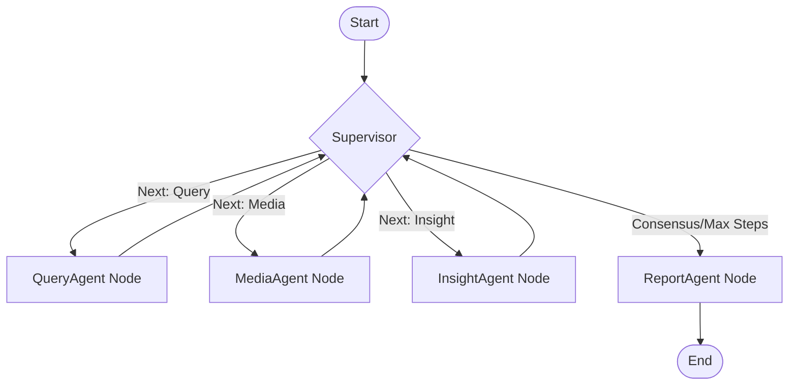
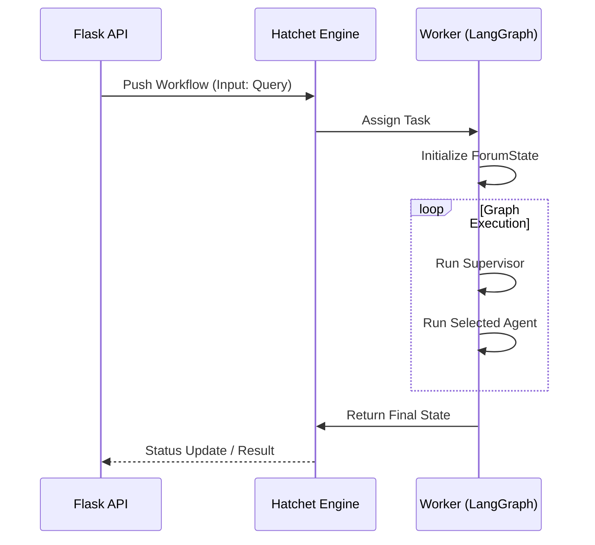
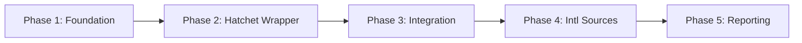

# Design Document

---
**Purpose**: Provide sufficient detail to ensure implementation consistency across different implementers, preventing interpretation drift.

**Approach**:
- Include essential sections that directly inform implementation decisions
- Omit optional sections unless critical to preventing implementation errors
- Match detail level to feature complexity
- Use diagrams and tables over lengthy prose

**Warning**: Approaching 1000 lines indicates excessive feature complexity that may require design simplification.
---

## Overview
**Purpose**: This feature modernizes BettaFish by replacing the fragile file-based agent collaboration system with a robust, durable, and observable stack using LangGraph and Hatchet.
**Users**:
- **Researchers**: Benefit from international data sources and reliable reports.
- **Developers**: Benefit from a typed, deterministic codebase and clear observability.
**Impact**: Changes the current runtime from a loose collection of subprocesses monitoring logs to a structured state machine managed by a distributed task queue.

### Goals
- Migrate orchestration to **LangGraph**.
- Implement durable execution and scheduling with **Hatchet**.
- Integrate **International Data Sources** (Google, Twitter, Reddit).
- Enable **Real-time Active Monitoring** via Hatchet Cron.

### Non-Goals
- Full rewrite of the core logic inside `InsightEngine` or `MediaEngine` (we will wrap them).
- Changing the frontend (Streamlit/Flask) significantly beyond API integration.

## Architecture

### Existing Architecture Analysis
The current system relies on `ForumEngine/monitor.py` tailing log files (`logs/*.log`) to trigger agents. This is brittle, hard to debug, and lacks state persistence.
- **Constraint**: Existing `Engine` classes (`QueryEngine`, `MediaEngine`) are tightly coupled to their own internal logic but loosely coupled via files.
- **Integration Point**: The new system must eventually expose an API that `app.py` can call, replacing the subprocess spawning.

### Architecture Pattern & Boundary Map

**Architecture Integration**:
- **Selected Pattern**: **Orchestrator-Workers** (LangGraph Supervisor) wrapped in **Durable Execution** (Hatchet).
- **Domain Boundaries**:
  - `ForumState`: Shared data contract.
  - `Nodes`: Encapsulate domain logic (Query, Media, Insight).
  - `Workflow`: Encapsulates execution reliability (Retries, Scheduling).
- **Steering Compliance**: Aligns with Stack A (LangGraph + Hatchet) decision.

### Technology Stack

| Layer | Choice / Version | Role in Feature | Notes |
|-------|------------------|-----------------|-------|
| Orchestration | LangGraph | Agent Coordination | StateGraph, Conditional Edges |
| Execution | Hatchet | Durable Workflow Engine | Retries, History, Distributed Workers |
| Language | Python 3.9+ | Core Logic | |
| State Storage | Postgres | Persistence | via Hatchet |
| Data Sources | Google/Twitter APIs | New Inputs | |

## System Flows

### Agent Orchestration Flow (LangGraph)


### Durable Execution Flow (Hatchet)


## Requirements Traceability

| Requirement | Summary | Components | Interfaces | Flows |
|-------------|---------|------------|------------|-------|
| 1.1 - 1.4 | Intl Data Integration | MediaAgentNode, QueryAgentNode | Google/Twitter Tools | Agent Execution |
| 2.1 - 2.6 | Agent Collaboration | SupervisorNode, ForumState | LangGraph State | Orchestration Flow |
| 3.1 - 3.5 | Active Monitoring | Hatchet CronWorkflow | Watchlist Table | Monitoring Loop |
| 4.1 - 4.2 | Observability | Hatchet UI | Workflow Run ID | All |
| 5.1 - 5.2 | Reliability | Hatchet SDK | Durable Steps | Recovery |

## Components and Interfaces

### Forum Engine (Orchestration)

#### ForumState
**Intent**: The single source of truth for the collaboration session.

**Responsibilities & Constraints**
- strictly typed `TypedDict`.
- Must be serializable for Hatchet/LangGraph checkpoints.

```python
class AgentOutput(TypedDict):
    agent_name: str
    summary: str
    data: Dict[str, Any]
    artifacts: List[str]

class ForumState(TypedDict):
    messages: Annotated[List[BaseMessage], operator.add]
    research_findings: Annotated[Dict[str, List[AgentOutput]], operator.add]
    user_query: str
    iteration_count: int
    next_speaker: str
```

#### SupervisorNode
**Intent**: Routes the conversation based on state analysis.

**Dependencies**:
- **Inbound**: `ForumState`
- **Outbound**: LLM (to decide next step)

**Implementation Notes**:
- Uses structured output (JSON mode) from LLM to select the next node.
- Implements loop termination logic (Max Iterations).

#### Wrapper Nodes (Query, Media, Insight)
**Intent**: Adapters that invoke legacy logic within the graph.

**Contracts**:
- Input: `ForumState`
- Output: `dict` (updates to state)

**Implementation Notes**:
- `QueryAgentNode` wraps `QueryEngine/agent.py`.
- `MediaAgentNode` wraps `MindSpider` & `MediaEngine`.
- `InsightAgentNode` wraps `InsightEngine`.
- Must handle sync-to-async adaptation if legacy code is blocking.

### Hatchet Integration

#### BettaFishWorkflow
**Intent**: The durable entry point for analysis.

**Contracts**:
##### Batch / Job Contract
- **Trigger**: API call or Cron
- **Input**: `{"query": string, "sources": list}`
- **Output**: Final `ForumState`
- **Idempotency**: Workflow runs are unique by ID.

```python
@hatchet.workflow(name="bettafish-analysis")
class BettaFishWorkflow:
    @hatchet.step()
    async def run_analysis(self, context):
        # ... invokes LangGraph ...
```

## Data Models

### Domain Model
- **Watchlist**: Stores active monitoring requests.
  - `id` (UUID)
  - `query` (Text)
  - `frequency` (Cron expression)
  - `last_result_hash` (String) - for diffing

### Physical Data Model (Postgres)
Hatchet manages its own schemas. We only need the **Watchlist** table for the monitoring feature.

```sql
CREATE TABLE watchlist (
    id SERIAL PRIMARY KEY,
    query TEXT NOT NULL,
    frequency TEXT DEFAULT '0 * * * *',
    last_result_hash VARCHAR(64),
    created_at TIMESTAMP DEFAULT NOW()
);
```

## Testing Strategy

- **Unit Tests**:
  - `SupervisorNode`: Mock LLM and verify routing logic (e.g., stops after max iterations).
  - `State`: Verify reducer logic (merging findings).
- **Integration Tests**:
  - **Graph Flow**: Run the graph in memory with mock agents to verify state transitions.
  - **Hatchet Worker**: Register workflow locally and trigger it to ensure successful execution.
- **E2E Tests**:
  - Full flow: API Trigger -> Hatchet -> Graph -> Legacy Tool -> Result.

## Migration Strategy



1.  **Foundation**: Build the Graph and Nodes (pure Python/LangGraph).
2.  **Wrapper**: Wrap Graph in Hatchet Workflow.
3.  **Integration**: Connect Flask API to Hatchet.
4.  **Sources**: Add Google/Twitter tools to the Nodes.
5.  **Reporting**: Update ReportEngine to consume `ForumState`.
