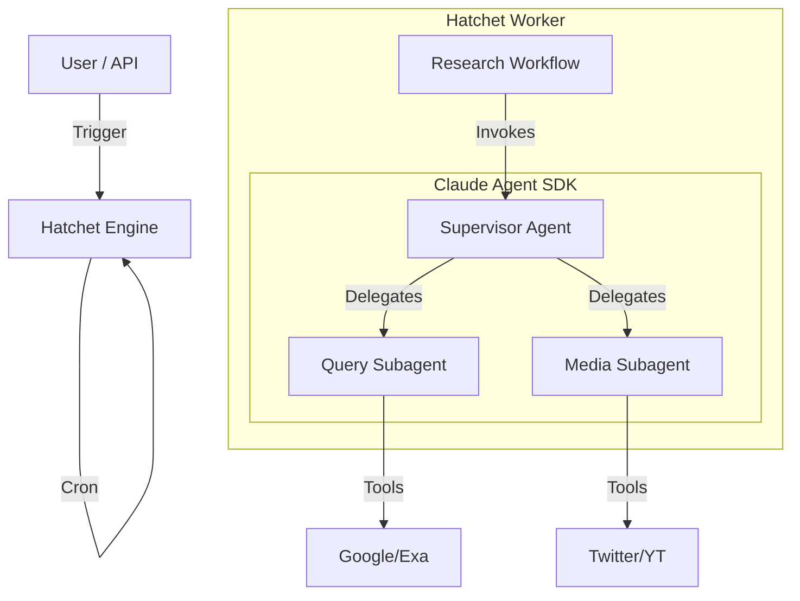

# Modernization Architecture Design (Claude Agent SDK + Hatchet)

## 1. Core Concept: "Agentic Swarm on Hatchet"
We will build a multi-agent system using the **Claude Agent SDK** for agent intelligence and **Hatchet** for durable workflow orchestration.

### Why this Stack?
*   **Claude Agent SDK**: Provides the "Brain". Handles reasoning, tool use, context management, and sub-agent delegation natively.
*   **Hatchet**: Provides the "Spine". Handles scheduling, retries, observability, and long-running process management.

## 2. Architecture Components

### A. The Agents (Claude Agent SDK)
We will define specialized agents using the SDK's `Agent` or `Subagent` primitives.

1.  **`SupervisorAgent` (The Host)**
    *   **Role**: Orchestrates the debate.
    *   **Capabilities**: Can call `QueryAgent` and `MediaAgent` as tools/subagents.
    *   **Logic**: "You are a forum moderator. Review the current findings. If more info is needed, call the appropriate researcher. If consensus is reached, summarize."

2.  **`QueryAgent` (Deep Research)**
    *   **Role**: Web researcher.
    *   **Tools**: `GoogleSearch`, `ExaSearch`, `FirecrawlScrape`.
    *   **Loop**: Plan -> Search -> Read -> Refine -> Answer.

3.  **`MediaAgent` (Social Pulse)**
    *   **Role**: Social media analyst.
    *   **Tools**: `TwitterSearch`, `YoutubeTranscript`, `RedditSearch`.
    *   **Loop**: Search Topics -> Extract Sentiment -> Summarize.

### B. The Workflows (Hatchet)
Hatchet wraps the agents to make them durable and schedulable.

1.  **`ResearchWorkflow`**
    *   **Trigger**: API (Ad-hoc) or Cron (Scheduled).
    *   **Step 1**: Initialize `SupervisorAgent`.
    *   **Step 2**: `SupervisorAgent.run(query)`.
    *   **Step 3**: Persist result to Database.

2.  **`MonitorWorkflow` (Active Watchlist)**
    *   **Trigger**: Hatchet Cron (e.g., every 15m).
    *   **Step 1**: Fetch active items from `Watchlist` table.
    *   **Step 2**: For each item:
        *   Call `MediaAgent` (for Topics) or `QueryAgent` (for Queries) to get *current* data.
        *   **Diffing**: Compare with last stored snapshot.
        *   **Evaluation**: Ask Supervisor "Is this new info significant?"
    *   **Step 3**: If significant -> Trigger `ResearchWorkflow` -> Notify User.

### C. Data Source Integration (Tools)
We will implement data sources as **MCP Tools** or native Python functions decorated with `@beta_tool`.

| Source | Tool Implementation |
| :--- | :--- |
| **Google** | `search_google(query: str)` |
| **Exa** | `search_exa(query: str, category: str)` |
| **Tavily (Legacy)** | `search_tavily(query: str)` |
| **Twitter** | `scrape_twitter(query: str, limit: int)` |
| **YouTube** | `get_video_transcript(url: str)` |
| **Weibo (Legacy)** | `scrape_weibo(keyword: str)` |
| **XHS (Legacy)** | `scrape_xhs(keyword: str)` |

## 3. Real-time Monitoring & Background Jobs

### Watchlist Schema
To support active monitoring, we need a new database structure:
```sql
CREATE TABLE watchlist (
    id UUID PRIMARY KEY,
    type VARCHAR(50), -- 'TOPIC' or 'QUERY'
    content TEXT,     -- "AI Agents" or "Latest LangGraph features"
    interval_minutes INT,
    last_checked TIMESTAMP,
    last_snapshot TEXT -- Summary of last findings for diffing
);
```

### Workflow Integration
1.  **Ad-hoc Queries**:
    *   User API -> `hatchet.admin.run_workflow("research_workflow", input={"query": "..."})`.
    *   Hatchet Worker -> Instantiates `SupervisorAgent` -> Agent calls sub-agents -> Returns final report.

2.  **Scheduled Monitoring**:
    *   Hatchet Cron -> Triggers `monitor_workflow`.
    *   Worker -> Iterates `watchlist` -> Checks for updates -> Diffs results.
    *   If spike/news detected -> Spawns `research_workflow` for deep dive.

## 4. Architecture Diagram


## 5. Requirements Traceability

| Requirement ID | Requirement Description | Architecture Component |
| :--- | :--- | :--- |
| **2.1** | International Data | Claude SDK Tools (Google, Exa, Twitter, etc.) |
| **2.2** | Agent Collaboration | Claude SDK Subagents + Supervisor Pattern |
| **2.3** | Real-time Monitoring | Hatchet Cron Triggers |
| **3.1** | Observability | Hatchet UI (Workflow) + Claude SDK Logs (Reasoning) |
| **3.2** | Reliability | Hatchet Durable Execution |
| **3.3** | Scalability | Hatchet Workers |
