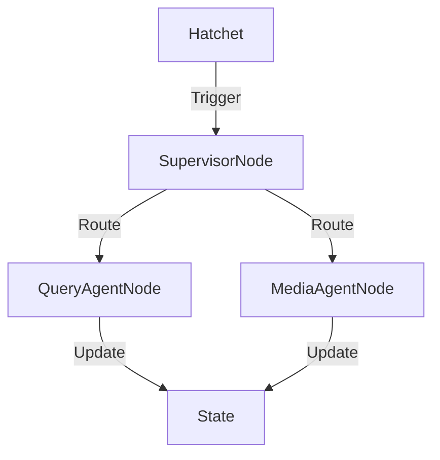

# Architecture Design: Stack A (LangGraph + Hatchet)

## 1. Core Concept: "The Forum as a Graph"
We replace the file-based `ForumEngine` with a **LangGraph StateGraph**, orchestrated by **Hatchet**.

### A. Shared State Schema
```python
class ForumState(TypedDict):
    messages: Annotated[List[BaseMessage], operator.add]
    research_reports: Dict[str, Any]
    media_insights: Dict[str, Any]
    next_speaker: str
```

### B. Nodes (Agents)
1.  **`SupervisorNode`**: Analyzes state, routes to agents.
2.  **`QueryAgentNode`**: Wraps `QueryEngine` (Search).
3.  **`MediaAgentNode`**: Wraps `MindSpider` (Social).

### C. Orchestration (Hatchet)
Hatchet triggers the graph execution and manages persistence.

*   **Ad-hoc**: `hatchet.run("langgraph_workflow", input=...)`
*   **Scheduled**: Hatchet Cron -> `monitor_workflow`.
    *   Iterates `Watchlist` table.
    *   Runs `MediaAgentNode` / `QueryAgentNode`.
    *   Diffs against `last_snapshot`.
    *   If significant, triggers full `SupervisorNode` debate.

### D. Watchlist Schema
```sql
CREATE TABLE watchlist (
    id UUID PRIMARY KEY,
    type VARCHAR(50), -- 'TOPIC' or 'QUERY'
    content TEXT,
    last_snapshot TEXT
);
```

## 2. Data Source Integration
*   **Search (QueryAgentNode)**:
    *   **Legacy**: Tavily (`basic_search`, `deep_search`).
    *   **New**: Google, Exa, Firecrawl (via Tool Registry).
*   **Social (MediaAgentNode)**:
    *   **Legacy**: Weibo, XHS, Bilibili, Douyin, Tieba, Zhihu (via `MindSpider`).
    *   **New**: Twitter, YouTube, Reddit (via Playwright Crawlers).

## 3. Diagram

